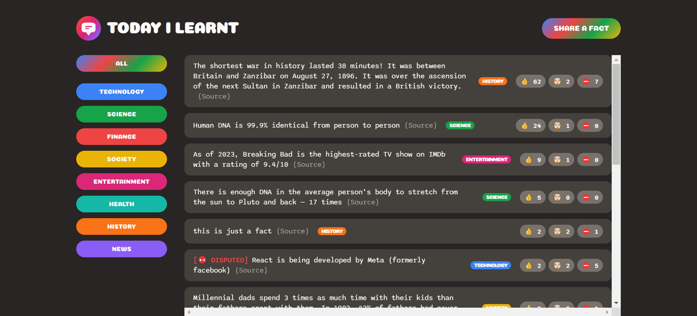

# Today I Learnt
"Today I Learnt" is an interactive web application designed for curious minds to share and discover new facts daily. Users can add their own facts along with the source, and others can vote on these facts as interesting, mind-blowing, or false. If a fact receives conflicting votes, it is marked with a "disputed" label, promoting a community-driven fact-checking process.

## Installation

### Prerequisites

- [Node.js](https://nodejs.org/) (version 18.12.0)
- [npm](https://www.npmjs.com/) (version 8.19.2)

### Clone the Repository

```bash
git clone https://github.com/your-username/your-repo-name.git
cd your-repo-name
```

### Install Dependencies

Using npm:

```bash
npm install
```

## Usage

### Running the Application

To start the application, use the following command:

```bash
npm start
```

### Running in Development Mode

For development mode with live reloading:

```bash
npm run start
```

## Take a Look



## Configuration

### Environment Variables

This project uses environment variables for configuration. Create a `.env` file in the root of your project and add the following variables:

```plaintext
SUPABASE_KEY=your-supabase-key
```

### Example `.env` File

```plaintext

# Supabase Key
SUPABASE_KEY=your-supabase-key
```

## License

This project is licensed under the MIT License - see the [LICENSE](LICENSE) file for details.

## Author
Purnima Kumar